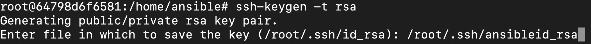

**Getting Started on Ansible Playbooks**

We are going to create a playbook that would perform the following tasks

- Create a user on the remote host
- Copy a file  and an SSH key to a specific location on the remote server
- Install packages
- Run a shell command
- Start and enable services
- Create a Docker Network

**Note:**  We will be creating a new user called "ansible-admin" on the remote host and will be using that user to run the playbooks going forward. Having a separate user to handle the ansible tasks keeps things tidy and it would be easy to know who made the changes if something goes wrong.


**Step 1:** Generate a key pair that we are going to store in the default location but with a different name. I am saving the newly generated key pair with the name "ansible". Here's how it is done


**Step 2:** Create a .yml file which would deploy the initial configuration.

```
nano config.yml
```

**Step 3:**  We are going to add a user and copy the SSH key, sudoers file to the remote host. Edit the config.yml file by adding the code below

```
- hosts: all
  become: true
  tasks:

#The remote host in this case is Ubuntu Server 

  - name: Adding an user who will be provisioning the services on the remote host
    ansible.builtin.user:
      name: ansible-admin
      group: sudo
      shell: /bin/bash

  - name: Copying the SSH key to the remote system to login without a password
    authorized_key:
      user: ansible-admin
      key: "{{ lookup('file', '~/.ssh/ansibleid_rsa.pub') }}"

  - name: Copying the sudoers file to remote system to prevent using sudo password
    copy:
      src: ansibleadmin
      dest: /etc/sudoers.d/ansible-admin
      owner: root
      group: root
```

- **Name:** Name is an ansible module where you can define the name of the task. It can be any thing and it is not really executed as a command
- **User(ansible.builtin.user):** It is an ansible module that lets you create users on the remote host. It can take in parameters like name, the group to which the user should be added to, shell, password, user id etc.
- **Authorized_key:** It is a module that lets you define the authorized to key to login to the remote host. This basically copies the specified public key to the *"~/.ssh/authorized_keys"* directory in the remote host. We are specifying the name of the user using the user module and we are using a variable to reference the public key.
  - Variables in ansible are declared with the syntax *"{{Variable_name }}"*. Ansible heavily uses the syntax of Jinja-2.  We are using the lookup module to lookup the public key in the mentioned location and then copy it to the remote host.

- **Copy(ansible.builtin.copy):** We are using the built-in ansible module called "copy" to copy a file from the local system to remote host. We have a sudoers file which basically helps us use "sudo" without a password. We are copying the file to the */etc/sudoers.d/* directory and we can use sudo without a password. Below is what is written in the sudoers file.

- **Owner and Group:**  We are specifying who is the owner and the group that can access the sudoers file using owner and group modules.

**Step 4:**  Install docker on the remote system.

```
 - name: Install Docker on the remote host
    package:
      name:
        - docker
        - docker.io
        - docker-compose
      state: latest
      update_cache: true
```

- **Package:** This is a generic package module that will use the package of the target system. When you run a playbook, ansible gathers facts about the target host which includes the package manager used by the remote system. Ansible pulls the information from in there, loads it into the package module and uses that as a package manager.
    -  This is very useful if you are installing packages on remote systems which use different package managers. Instead of creating multiple tasks with different package managers, you can create one task which will solve for every host.
    -  Please note that *"ansible.builtin.package"* and "package" are the exact same thing. You do not have to specify the "ansible.builtin" before the module name.
- **Name:** We list the names of all the packages you want to install.
- **State:latest**  This basically updates the package if it is not the latest one
- **Update_cache:true**  This is basically the equivalent of *"apt update"* in a debian machine. It updates the packages.

**Step 5:**  Make the newly created user a part of the docker group so he wouldn't need to use sudo to execute docker commands.

```
#Adding the user to the docker group so that we can run docker commands without sudo

  - name: Add the user to the docker group 

    shell: usermod -aG docker ansible-admin
```

- We are basically running a shell command that would add the user to the docker group. 


**Step 6:**  Install pip3 for python  and  install python docker sdk, this is a mandate installation since we would need this to use docker with ansible on the remote machine.

```
#Installing dependecies to use docker with ansible

  - name: Install pip3 for Python 
    package:
      name:
        - python3-pip

  - name: Install Python Docker SDK
    pip:
      name:
        - docker
        - docker-compose
```

- We are using the *"ansible.builtin.package"* module to install pip3 for python and then we are using pip to install the SDK for docker.

**Step 7:** Start the docker service and enable it on boot-up

```
#Starting the docker service and enabling so that we can deploy docker containers and manage them

  - name: Starting and enabling the docker service
    service:
      name: docker
      state: started
      enabled: true
```

- We are using the "ansible.builtin.service" module to start the docker service and enable it on boot up. Ansible will make sure that the state of the service is started when you run the playbook.

**Step 8:** Create a docker network so that we can attach containers to it.

```

# Creating a docker network to solve for communication between the containers

  - name: Creating a docker network
    docker_network:
      name: website-network
```

- We are using the *"community.general.docker_network"* module to create a docker network. We will then be attaching all the containers to this bridged network.

We can now go ahead and run this playbook that we created by using the following command. 

```
ansible-playbook config.yml
```

We now have a user called "ansible-admin" and we are going to use this user to provision tasks on the remote host. To do so, we will have to change the ansible.cfg file.  

```

[defaults]

inventory = inventory
remote_user = ansible-admin
private_key_file = ~/.ssh/ansibleid_rsa
```

- Change your ansible.cfg file and add the path to the private key for the newly added user and the remote user name.

Now that we have deployed initial configuration on the remote server, we can deploy containers which are essential for the air force challenge.

Navigate to [Container Playbook](containers_playbook.md)
