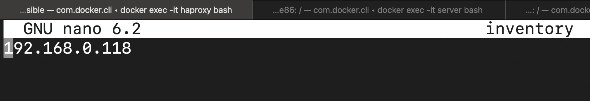
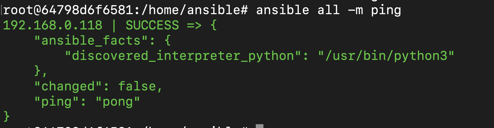

# AirForceLeague-CCDC

This repository contains the configuration files for the Air Force Cyber Defense League organized by University of Massachusetts Lowell  Research Institute.  

**Task:**The task is to deploy infrastructure using an automation tool called  "ansible" and perform specific tasks which would secure the air force infrastructure.

**Getting Started**
  Follow the below mentioned steps to deploy the infrastructure on any machine.

**Scenario:** Consider a production environment where you have multiple servers and you will have to deploy virtual machines/containers or patch updates. You might have to add or delete user accounts. Ansible lets you do all of that and more from a single workstation.

I am using a docker container running ubuntu as my workstation. I am a root user in the container and hence I do not need super user privileges to run the commands or install something. If you are not a root user, you will need super user privileges and once you have the privileges, you can use super-user-do(sudo) to make changes.

**Part 1:** Getting your workstation ready.

Step 1:  Install ansible and community.docker on the workstation. The "ansible galaxy community.docker" contains many plugins that will help you use docker with ansible.

```
apt install ansible
ansible-galaxy collection install community.docker
```

Step 2: Create a directory where you will be having all the ansible configuration files
``` mkdir ansible ```

**Part 2:**  Configure ansible to provision the remote servers

Step 1: Creating an inventory file . This file would contain the IP address or the Fully Qualified Domain Name of the remote server you are going to deploy services on. We are going to provision a single remote server as you can see in the screenshot below.
```nano inventory```
  

Step 1a:  Ansible uses SSH to connect and execute the tasks on the remote host and hence the pre-requisites would be to have SSH enabled on the remote hosts and have your SSH public key copied to them.

- You can copy the public key of your host machine to the remote host using the following commmand
``` ssh-copy-id  -i /path/to/your/publickey  user@remotehost ```
- Please note that you will need the password of the remote host to copy the ssh key.
- Once the ssh key is copied to the remote host, you can log in as that user without having to put in a password.  

Step 2: Create an "ansible.cfg" file which would overwrite the default configuration file. I prefer doing this because it would give you control over the configuration file and does not have all the default comments that look overwhelming.

``` nano ansible.cfg ```
We will have to make a couple of changes here:

- Reference the inventory file that we created above.
- Specify the remote user you are going to be logging in as and in this case it is "user" .
- This is how a ansible configuration file would look like

```
 [defaults]
inventory = inventory
remote_user = user
```

Step 3: Once you create the inventory file and the ansible configuration file, you can check if you are able to connect to the remote hosts by using an ad-hoc command.

``` ansible all -m ping ```

- "ansible all" basically means that you are pinging all the hosts. -m stands for module. I did not specify the key to access the remote host because I am using the default SSH key and I had the public key copied to the remote host already.
- Here's how the output would look like.


Now that the connection is established between the workstation and the remote host. We are ready to provision and manage services on the server.
Ansible uses playbooks which have tasks inside them and we execute those tasks on the remote hosts. Playbooks are  a ".yml" file.
