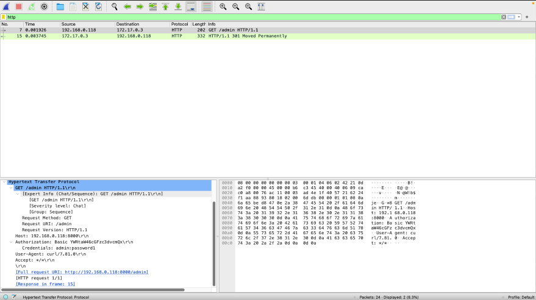

**Vulnerability**

As we have seen in the  [Container Playbook](containers_playbook.md) that we have  a web server that is running on http protocol.

- We can access the webserver now using http. But http is not secure since it is not encrypted which technically means that if someone logs into the server, the credentials are going to be un-encrypted.

- We can check if that works by logging to the admin page and sniff the credentials using a packet sniffer.

```
 tcpdump -i any -port 8000 --out packet.pcap
```

- This will read all packets that is using protocol 8000
- -i labels all ethernet ports the device
- -port specifies what port we want to listen on.
- --out outputs the information into a file to read later on.

The above command will be capturing packets on port 8000 and will be ouputting it to a file. You can now go ahead and open up the web page on your browser.

Navigate to the website by typing this down in the url 

```

http://ipaddress:8000/admin
```

- This will take you to the admin page. Type in random credentials and hit login.  The tcpdump tool would have captured the packets and ouput them into a file. We can analyse these packets using a tool called wireshark.

- Open the file with wireshark and search HTTP in the filter field.

The information can be found under: 
 GET /admin HTTP/1.1 > Hypertext Transfer Protocol > Get /Authorization > Credentials as shown below.

  


As we have seen, the credentials can be sniffed using a packet sniffer tool and the access to admin page is available to anybody which makes it vulnerable to brute-force attacks which can lead to your credentials getting compromised, there is dire need for security. 

Navigate to [HAProxy and Hardening](haproxy&Hardening.md) to see the security measures that can be taken.