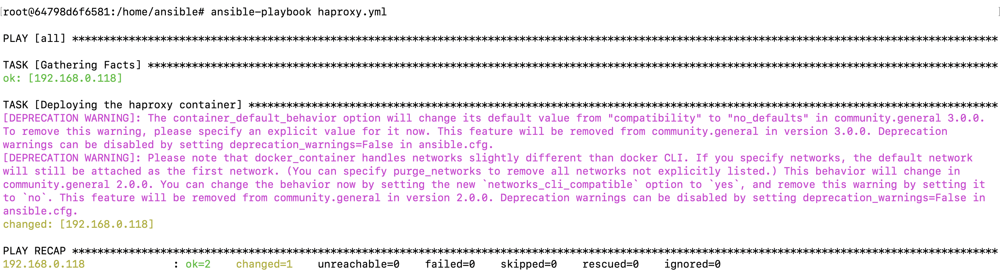
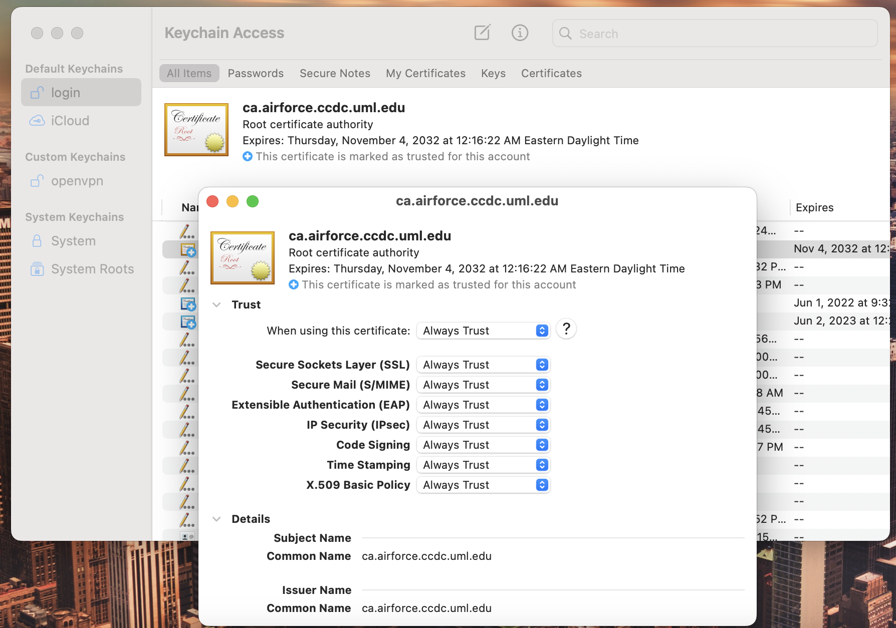
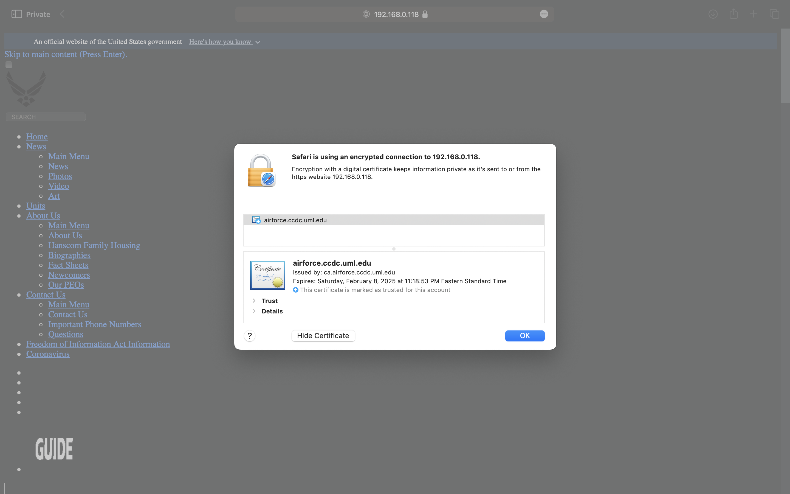

**Getting started with HAproxy configuration**

- As we have seen in [Vulnerability](Vulnerability.md) that there is a vulnerability, we are now going to implement some security measures and harden the web server.

**The goal of this playbook and configuration is to solve for the following:**

- Securing our webserver by limiting the direct access to the web server, we are using haproxy instead to re route the traffic to the server. We would be listening on port 80 and port 443 for http requests.
- We have seen that http sends username and passwords in the plaintext to the server which can be sniffed. To prevent this, we will be implementing https for which we would need a signed certificate from a certificate authority since https requires us to verify the server's identity which can be done by using a certificate.
- We will be signing our own certificate by creating a certifcate authority
- We have seen  earlier that we had access to the /admin page on the web server which is never safe and hence we will be limiting the access to the /admin page using an access control list which is an additional security measure haproxy offers.
- It is difficult for a single server to manage all the http requests that are coming in and hence we are going to add an additional server that will provide us with  load balance and provide high availability.

The pre-requisites for this would be the  *" server's certificate"*  and we are going to follow the below mentioned steps  to:
         - Create a certificate authority
         - Self sign the server's certificate

**Step 1 : Setup a Certificate Authority**

- Login to Ubuntu server
- Install easyrsa: sudo apt install easy-rsa -y
- Init PKI structure: /usr/share/easy-rsa/easyrsa init-pki
- Build CA certificate w/o pass: /usr/share/easy-rsa/easyrsa build-ca nopass
- Common Name: canickmanoj (or whatever you want to call it) (If left blank = ca.crt)

- Example output:

```
            CA creation complete and you may now import and sign cert requests.
           Your new CA certificate file for publishing is at:
           /home/usr/easy-rsa/pki/ca.crt
           (Make sure to remember where this .crt file is)
```

**Step 2:  Create Keypair Request & Sign It:**

- Create keypair request: /usr/share/easy-rsa/easyrsa gen-req <request-name> nopass
       - Common Name: You can modify what you would like the keypair to be called (If left blank = keypair.key & keypair.req).
       - In this case, the common name is "airforce.ccdc.uml.edu"

```
 Sample Output: 

 Keypair and certificate request completed. Your files are:
req: /home/user/pki/reqs/airforce.ccdc.uml.edu.req
 key: /home/user/pki/private/airforce.ccdc.uml.edu.key
```

**Step 3. Sign request:**

- Run the following  command to sign the generated request

 ```
  /usr/share/easy-rsa/easyrsa sign-req server airforce.ccdc.uml.edu
  ```

- Output Example:

```
 Certificate created at: /home/user/pki/issued/airforce.ccdc.uml.edu.crt
```

**Step 4. Create a .pem file:**

- The .pem file is a combination of the private key and the certificate itself. Run the following command to create a .pem file. Make sure to replace the path to the file based on your directory structure

 ```
  cat pki/issued/ccdc23af.cyber.uml.edu.crt pki/private/airforce.ccdc.uml.edu.key > pki/issued/airforce.ccdc.uml.edu.pem
```

- Now that we have the certificate, we can create haproxy configuration that would harden our web server. 

 **Step 1 :** Create an haproxy configuration file

 ```
 nano haproxy.cfg
 ```

 **Step 2:** Copy the below code into your haproxy configuration

```
defaults
timeout client 30s

global
    ssl-default-bind-options ssl-min-ver TLSv1.2

frontend fe1_http
    mode http
    bind *:80
    bind *:443 ssl crt /usr/local/etc/haproxy/airforce.ccdc.uml.edu.pem
    acl restricted_page path_beg /admin
    http-request redirect scheme https unless { ssl_fc }
    use_backend be1_http unless restricted_page


backend be1_http
    mode http
    balance roundrobin
    server website1 django-site:8000
    server website2 django-site1:8001

  ```

*Frontend:*  This is where haproxy listens on, binds to ports, does access control etc
*Backend* We will be defining our servers here and the haproxy listens on the frontend and redirects it to the backend.

**Mode:** This defines the mode of traffic that the proxy listens for and we are listening for http traffic since we are going to get http requests to our server.

**bind:** This defines the ports haporxy will be listening on. We are listening on ports 80 and 443 which are default ports for http and https. We can specify a ip address in the place of "*" and the haproxy will listen for the traffic to that particular ip on both the ports. We are listening for traffic coming to any ip on the above stated ports.

**bind *:443**  We have defined a Secure Socket Layer certificate that has been signed before. When using https, the communication is encrypted and hence you would need a certificate which would verify that it is really airforce.ccdc.uml.edu that we are using and not a insecure website.  We are esentially verifying our server's identity by giving it a certificate. Please note that you will have to sign your certificate and specify the path to your file.


  **http-request redirect scheme https unless { ssl_fc }** - This redirects the http requests to https by which we are eliminating the use of http

 **acl restricted_page path_beg /admin** - This blocks the page when the path begins with /admin.

*use_backend:* This specifies which backend to use and redirect the http requests to.  *unless restricted_page*   - We are redirecting http requests to the backend servers and if it is *restricted_page* , we are not giving it any backend. When anyone tries to access this, they will get a 503 error.


*balance: roundrobin*  When a http request comes in, the haproxy is going to load balance the incoming requests between the two servers.

*server:*  We are specifying the name (which can be anything)  of the server and the django containers that we have created.

**Step 3:**  Deploy a haproxy container with the above configuration.

```
nano haproxy.yml
```

```

- hosts: all
  tasks:

# Deploying the haproxy container on the remote host. Using a host volume here to provision changes t>
# 443 from host machine to the haproxy container to use http and https
    - name: Deploying the haproxy container
      become_user: ansible-admin
      docker_container:
        name: haproxy
        hostname: haproxy
        image: haproxy:latest
        pull: true
        state: started
        detach: yes
        restart_policy: always
        networks:
          - name: website-network
        published_ports:
          - "80:80"
          - "443:443"
        volumes:
          - /home/ansible-admin/haproxy:/usr/local/etc/haproxy/

```

- We are mapping port 80 and 443 from host to the container.

**Step 4:**  Run the playbook

```
ansible-playbook haproxy.yml
```



We have now deployed an haproxy container that will proxy the incoming requests and redirect the requests based on the conditions that we have specified earlier in the configuration file. 


 **Note:**  In the [Containers Playbook](containers_playbook.md) we have seen that we have deployed two django containers. The underlying reason for doing this is to solve for high availability and load balancing. We are using haproxy which is a load balancer and a proxy.  We are using a round robin algorithm which would balance between the two backend servers that we defined. This solves for high availability and we have two servers which will serve http requests instead of a single server.


- You can now access the web page from a Linux host by running the following command

```

curl https://airforce.ccdc.uml.edu 

```


**Note:** Since this is a self - signed certificate, you will have to explicitly make your browser trust the certificate by going into the browser settings. If this was signed by a certified certificate authority, you will no longer need to explicitly change the certificate trust settings.

  


- If the user is trying to access <https://ipaddress/admin>; the output looks like below. We are not able to access the web

[Error](images/503.png)

- If you try to access https://ipaddress; the https request does go through and we will be able to see the content.


